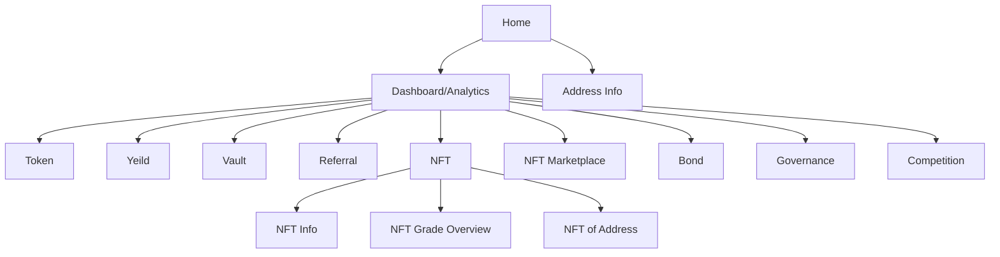

# Sitemap

```mermaid
graph TD
  A[Home] --> B[Dashboard/Analytics]
    B --> C[Token]
    B --> D[Yeild]
    B --> E[Vault]
    B --> F[Referral]
    B --> G[NFT]
      G --> G1[NFT Info]
      G --> G2[NFT Grade Overview]
      G --> G3[NFT of Address]
    B --> H[NFT Marketplace]
    B --> I[Bond]
    B --> K[Governance]
    B --> L[Competition]
    %% B -> M[Public Sale]
  A[Home] --> Z[Address Info]
```
